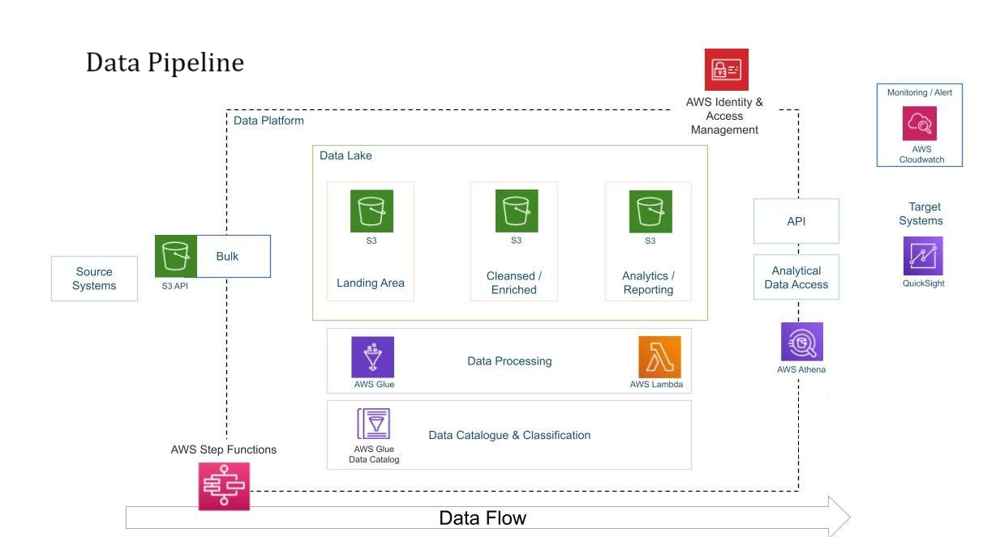

# YouTube Big Data Analysis Project

## 🌟 Overview  
This project focuses on building a **scalable, cloud-based data pipeline** to ingest, process, and analyze large-scale YouTube data. By leveraging **AWS services**, we ensure efficient data storage, transformation, and visualization for actionable insights.  

## 🔥 Key Features  
- **Automated Data Ingestion** – Extracts data from multiple sources.  
- **ETL Pipeline** – Cleans, transforms, and structures raw data using AWS Glue.  
- **Scalable Data Lake** – Stores and manages structured/unstructured data in Amazon S3.  
- **Serverless Data Processing** – AWS Lambda automates computations without server management.  
- **Interactive Querying** – AWS Athena enables SQL-based querying on large datasets.  
- **Secure Access Control** – AWS IAM ensures role-based access and security.  
- **Cloud-Native & Cost-Effective** – Optimized for performance and scalability with minimal operational costs.  
- **Real-Time Analytics Dashboard** – Amazon QuickSight provides rich BI visualizations.  

## 🏗️ Architecture  
The architecture is designed to be **serverless, highly available, and scalable**, leveraging **AWS services** to streamline data processing and analytics.




### **🔹 Workflow**:  
1. **Data Ingestion** – Extracts raw data from YouTube and other sources.  
2. **Data Storage** – Centralized storage in **Amazon S3**.  
3. **Data Transformation** – ETL using **AWS Glue**.  
4. **Query Processing** – SQL-based querying with **AWS Athena**.  
5. **Serverless Execution** – AWS Lambda automates transformations.  
6. **Reporting & Visualization** – **Amazon QuickSight** generates real-time insights.  

## 🛠️ Technologies Used  
| Technology | Purpose |  
|------------|---------|  
| **Amazon S3** | Scalable data lake storage |  
| **AWS IAM** | Secure access control & authentication |  
| **AWS Glue** | Serverless ETL data transformation |  
| **AWS Lambda** | Serverless compute for automated processing |  
| **AWS Athena** | SQL-based querying on S3 data |  
| **Amazon QuickSight** | BI dashboard for visualization & insights |  

## 🚀 Getting Started  

### **🔹 Prerequisites**  
- AWS Account with IAM permissions  
- AWS CLI installed & configured  
- Basic knowledge of **AWS services** (S3, Glue, Athena, Lambda, QuickSight)  

### **🔹 Installation & Setup**  
1️⃣ **Clone the Repository**  
```bash
git clone https://github.com/your-username/youtube-big-data-analysis.git
cd youtube-big-data-analysis
```

2️⃣ **Set Up AWS Services**

- Create an S3 Bucket for data storage.
- Set up AWS IAM Roles for access control.
- Configure AWS Glue Jobs for ETL processing.
- Deploy AWS Lambda functions for automation.
- Enable Athena queries for data analysis.
- Build QuickSight dashboards for reporting.

## 📈 **Dashboard & Reporting**
The project includes interactive BI dashboards built using Amazon QuickSight, providing real-time insights and trend analysis on YouTube data. I have attached a copy of the dashboard in this repository.

## 🎯 **Future Enhancements**
- Implement machine learning models for trend prediction.
- Integrate real-time streaming for live analytics.
- Optimize AWS Glue transformations for cost efficiency.
